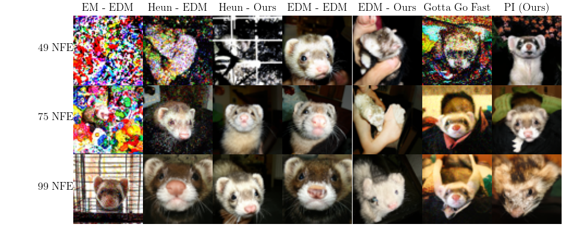

# Adaptive Second-Order Solvers for Generative Diffusion Sampling
## By anonymous authors
This is the implementation of the thesis: Proportional-Integral Time-Step Adaptive Solvers in Diffusion, which implements an adaptive diffusion sampler
using Proportional Integral (PI) control based on an adaptive solver by [Ilie et al (2015)](https://link.springer.com/article/10.1007/s11075-014-9872-6). 
This repository also contains an implementation of extracting average discretisations from the PI controlled adaptive solver.
Furthermore, this repository has an implementation of several other diffusion samplers, including Euler-Maruyama, Stochastic Heun, the adaptive solver by
[Jolicoeur-Martineau et al (2021)](https://arxiv.org/abs/2105.14080), and the EDM solver [(Karras et al, 2022)](https://arxiv.org/abs/2206.00364). We also
adapt our solver to work with [BitstreamDiffusion](https://arxiv.org/abs/2605.07013), therefore, a fork of this repository is attached, that adds compatibility
with our sampler and schedule generation methods.



## Installation
Ensure your Python version is 3.12. Then, install pytorch 2.10.0 using the installation instructions provided [here](https://pytorch.org/get-started/locally/).
Preferably, install for CUDA, as otherwise sampling is slow.

After installing pytorch, install the requirements using 
```bash
# Install dependencies
pip install -r requirements.txt
```
Finally, to allow easy usage of the command line tool, run
```bash
# Install repository as a package
pip install -e .
```
### BitstreamDiffusion installation
To run the language experiments, follow the installation instructions in the `BitstreamDiffusion/README.md` file (Step 1 and Step 2).

## Ref files
### ImageNet-64 Ref files
To be able to compute metrics for the ImageNet-64 dataset, please download the following ImageNet-64 reference files
from https://anonymous-hf.com/a/yx1cozswnfwp/. Alternatively, these files can be reproduced
as well. The method Karras et al (2024) use in [this](https://github.com/NVlabs/edm2) repository is used. First,
download the ImageNet dataset from [Kaggle](https://www.kaggle.com/competitions/imagenet-object-localization-challenge/data)
and extract it to a folder (e.g. documents/imagenet).
Then  run the command:
```bash
# Convert ImageNet images to 64x64
python dataset_tool.py convert --source=documents/imagenet/ILSVRC/Data/CLS-LOC/train \
    --dest=datasets/img64 --resolution=64x64 --transform=center-crop-dhariwal
```
This converts the dataset to 64x64 resolution.

Then, run
```bash
# Detect features on ImageNet-64
evaluate-images -b 512 gen-features datasets/img64 -o refs/img64_feautures.pkl --statistics_out refs/img64_stats.pkl
```
This computes the necessary feature vectors and puts them in the `refs` folder.

### FFHQ Ref files
To be able to compute metrics for the FFHQ dataset, please download the following FFHQ reference files
from https://anonymous-hf.com/a/yx1cozswnfwp/. Alternatively, these files can be reproduced
as well. The method Karras et al (2024) use in [this](https://github.com/NVlabs/edm) repository is used. First,
download the FFHQ dataset from [here](https://github.com/NVlabs/ffhq-dataset)
and extract it to a folder (e.g. documents/ffhq).
Then  run the command:
```bash
# Convert ImageNet images to 64x64
python dataset_tool.py convert --source=documents/ffhq \
    --dest=datasets/ffhq_64 --resolution=64x64
```
This converts the dataset to 64x64 resolution.

Then, run
```bash
# Detect features on ImageNet-64
evaluate-images -b 512 gen-features datasets/ffhq -o refs/ffhq_feautures.pkl --statistics_out refs/ffhq_stats.pkl
```
This computes the necessary feature vectors and puts them in the `refs` folder.

## Usage
This repository provides a series of command line tools for easy use. Each has an extensive help menu for exact usage. Each 
provided command is listed below with its basic usage explained and a usage example. Additionally, we provide a command
to reproduce the main tables.

### Reproducing the Tables
#### FFHQ
To reproduce the FFHQ (Table 1) results, run
```bash
# FID-NFE sweeps over multiple sampler-schedule configurations
nfe-sweep pi_solvers/configs/ffhq_config.py
```
This will then output the generated images and results to `data/ffhq`

#### ImageNet-64
To reproduce the ImageNet-64 (Table 1) results, run
```bash
# FID-NFE sweeps over multiple sampler-schedule configurations
nfe-sweep pi_solvers/configs/img_config.py
```
This will then output the generated images and results to `data/ffhq`

#### LM1B
To reproduce the LM1B results (Table 2), run 
```bash
cd BitstreamDiffusion
```
Then, run
```bash
# PPL-NFE sweeps over multiple sampler-schedule configurations
torchrun --standalone --nnodes=1 --nproc_per_node=1 \
  -m evaluation.run_eval \
  --config configs/lm1b/continuous/eval/rate_eval_seeds_sweep.py \
  --metrics external_ppl
```
To compute the external perplexity, and run
```bash
# Compute token unigram entropy
python -m evaluation.compute_entropy_from_caches \
  --config configs/lm1b/continuous/eval/rate_eval_seeds_sweep.py \
  --include_real
```
To compute the entropy. 

### Tolerance Grid Search
This tool is for computing the tradeoff of the PI solver for $\tau_{abs}$ and $\tau_{rel}$. This computes NFE at each point
in the grid, and optionally computes a metric at each point in that grid as well. For more usage information, run
```bash
# Tolerance grid usage information
tolerance-grid-search -h
```
An example usage of this command is:
```bash
# Tolerance grid search example command
tolerance-grid-search 0.01 0.1 10 50 20 "data/tolerance_grid/test" --metric MIND --ref refs/img64_features.pkl \
  --model https://nvlabs-fi-cdn.nvidia.com/edm2/posthoc-reconstructions/edm2-img64-xl-0671088-0.040.pkl 
```
Which uses the EDM2-XL-FID checkpoint to generate Imagenet-64 images an a tolerance grid of $\tau_{abs}\in[0.01, 0.1]$ and
$\tau_{rel}\in[10, 50]$ on a grid with resolution 20, computing the MIND metric.

### Image Generation
This tool is for generating image samples. Note that this tool currently only generates using models that are compatible
with the EDMSDE, thus running from noise $80$ to $0$. For usage information, run
```bash
# Image generation usage information
generate-images -h
```
This command has one sub-command for each solver, for which usage information for each can be obtained using
```bash
# Image generation solver usage information
generate-images SOLVER_NAME -h
```
Filling in `SOLVER_NAME` with the name of the solver you want to use.

An example usage of this command is:
```bash
# Generate 50000 images using the PI solver at 75 NFE
generate-images -b 48 -o data/image_testing/pi/75NFE -n 50000 -m https://nvlabs-fi-cdn.nvidia.com/edm2/posthoc-reconstructions/edm2-img64-xl-0671088-0.040.pkl \
  pi --tau_a 0.06 --tau_r 14.5 --h_start 40
```
This runs the PI solver with a batch size of 48, generating 50000 images and outputting these, and information on the run,
to `data/image_testing/pi/75NFE`. Note that each PI solver command will output a file to a new data directory at the
output path named `_t.csv`. This csv file can be used as the input to compute an average PI discretisation, which can
be added using the `--pi_discretisation` flag on the EDM, EM, or heun solver.

### Metric Evaluation
This tool is for evaluating metrics such as the FID on images generated by the `generate-images` tool.
To find out more about the command, run
```bash
# Image evaluation usage
evaluate-images -h
```
Note that this tool has two subcommands: `gen-features` and `eval-features`. `gen-features` is for generating
the feature vectors of a dataset or of generated data. Its functionality is also encompassed in `eval-features`,
but this specifically allows separate computation of feature vectors, useful for computing reference statistics
on a new dataset. The `eval-features` is a more often useful command, and its usage can be obtained by running
```bash
# Feature evaluation usage
evaluate-images eval-features -h
```
An example use case is:
```bash
# Evaluate 50000 images generated earlier on the FID, MIND, Precision, and Recall metrics
evaluate-images -b 512 -n 50000 eval-features data/image_testing/pi/75NFE/images refs/img64_features.pkl \
      --metric MIND --metric FID --metric PrecisionRecall -o data/image_testing/pi/75NFE/data --ref_statistics refs/img64_stats.pkl
```
This evaluates the MIND, FID, Precision, and Recall of the images in the directory `data/image_testing/pi/75NFE/images`
compared with ImageNet-64 reference statistics, outputting this to an output file in the runs data directory. 

### Create Image Sample
This is a very simple tool, used to generate sample images, used to e.g. show samples in a paper. Usage
information can be obtained with
```bash
# Create image sample usage
create-image-sample -h
```
To create a 6x6 grid of images from some images in a directory, run:
```bash
# Create 6x6 grid sample
create-image-sample data/image_testing/pi/75NFE/images -n 36 -n_cols 6 -o data/image_testing/pi/75NFE
```

### Gaussian Testing
A tool to run 1D experiments on multimodal Gaussians is also provided. This evaluates the Euler-Maruyama,
Heun, and PI solver over different NFE in terms of Wasserstein Distance. Usage of this tool can be 
obtained with
```bash
# Gaussian testing usage
gaussian-testing -h
```
An example use case is:
```bash
# Run Gaussian tests on a complex Gaussian
gaussian-testing 10 200 0.05 5 -g "complex" -o "data/gaussian_experiment/complex/" --h_start 0.15
```
This runs the Heun and Euler-Maruyama solver from 10 to 200 NFE, and the PI solver from $\tau_{abs}=0.05$ 
to $\tau_{abs}=5$. Note that this reproduces Figure 1a from the paper.